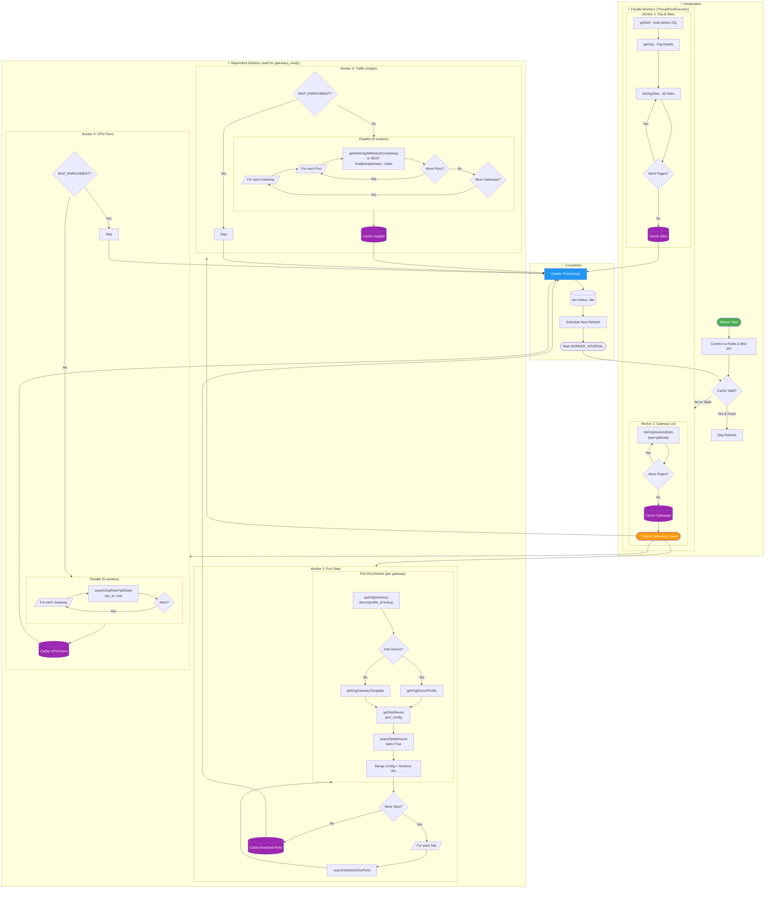

# MistCircuitStats-Redis

A Redis-cached version of MistCircuitStats that supports multiple concurrent users without consuming additional API tokens.

## Architecture

```
┌─────────────┐     ┌─────────────┐     ┌─────────────┐
│   Browser   │────▶│   Flask     │────▶│   Redis     │
│   (Users)   │◀────│   Web App   │◀────│   Cache     │
└─────────────┘     └─────────────┘     └─────────────┘
                                              ▲
                           ┌──────────────────┘
                           │
                    ┌──────┴──────┐
                    │  Background │────▶ Mist API
                    │   Worker    │
                    └─────────────┘
```

### Components

- **Redis**: Caches all gateway data, VPN peer paths, and traffic insights with configurable TTL
- **Worker**: Background process that periodically fetches data from Mist API and populates Redis
- **Web App**: Read-only Flask application that serves data from Redis cache

### Benefits

- **Token Efficiency**: Only the worker consumes API tokens, regardless of user count
- **Fast Responses**: Redis provides sub-millisecond response times
- **Scalable**: Multiple web app replicas can share the same Redis instance
- **Resilient**: Data remains available even during brief Mist API outages

## Quick Start

### Prerequisites

- Docker and Docker Compose
- Mist API Token(s)

### 1. Clone and Configure

```bash
git clone https://github.com/yourusername/MistCircuitStats-Redis.git
cd MistCircuitStats-Redis

# Copy example environment file
cp .env.example .env

# Edit .env with your Mist API token(s)
nano .env
```

### 2. Run with Docker Compose

```bash
# Production mode
docker-compose up -d

# View logs
docker-compose logs -f

# Development mode (with hot reload)
docker-compose -f docker-compose.dev.yml up
```

### 3. Access the Dashboard

Open http://localhost:5000 in your browser.

## Configuration

### Environment Variables

| Variable | Description | Default |
|----------|-------------|---------|
| `MIST_API_TOKEN` | Comma-separated list of Mist API tokens | Required |
| `MIST_ORG_ID` | Mist Organization ID (auto-detected if not set) | Auto |
| `MIST_HOST` | Mist API hostname | `api.mist.com` |
| `REDIS_URL` | Redis connection URL | `redis://localhost:6379` |
| `WORKER_INTERVAL` | Data refresh interval in seconds | `300` (5 min) |
| `LOG_LEVEL` | Logging level (DEBUG, INFO, WARNING, ERROR) | `INFO` |
| `SKIP_ENRICHMENT` | Skip VPN peers and insights for faster load | `false` |
| `PARALLEL_WORKERS` | Number of parallel threads for fetching | `5` |
| `USE_CACHED_ON_STARTUP` | Use cached data on startup if valid | `true` |
| `INCREMENTAL_REFRESH` | Skip refresh if cache is still fresh | `true` |
| `STALE_THRESHOLD` | Seconds before cache is considered stale | `600` |

### Multiple API Tokens

For large organizations, use multiple API tokens to avoid rate limiting:

```env
MIST_API_TOKEN=token1,token2,token3
```

The worker will automatically rotate between tokens when rate limited.

## Development

### Local Development (without Docker)

```bash
# Create virtual environment
python -m venv .venv
source .venv/bin/activate

# Install dependencies
pip install -r requirements.txt

# Start Redis (using Docker)
docker run -d -p 6379:6379 redis:7-alpine

# Copy and configure environment
cp .env.example .env
# Edit .env with your settings

# Run worker in one terminal
python worker.py

# Run web app in another terminal
python app.py
```

### Project Structure

```
MistCircuitStats-Redis/
├── app.py              # Flask web application (read-only)
├── worker.py           # Background data fetcher
├── redis_cache.py      # Redis cache manager
├── mist_connection.py  # Mist API connection handler
├── templates/
│   └── index.html      # Dashboard template
├── docker-compose.yml  # Production Docker setup
├── docker-compose.dev.yml  # Development Docker setup
├── Dockerfile
├── requirements.txt
└── .env.example
```

## Data Flow

1. **Worker starts**: Fetches all data from Mist API
2. **Data cached**: Gateways, VPN peers, and insights stored in Redis with TTL
3. **Users connect**: Web app serves data directly from Redis (instant)
4. **Worker refreshes**: Every N seconds (default 5 min), worker updates cache
5. **Cache expires**: If worker fails, data expires after 3x refresh interval

## Worker Data Fetch Flow

The worker uses parallel threads with dependency coordination to efficiently fetch data from the Mist API:



### Key Design Patterns

| Pattern | Implementation | Benefit |
|---------|----------------|---------|
| **Parallel Workers** | 5 ThreadPoolExecutor threads | Faster data collection |
| **Event Signaling** | `threading.Event()` for `gateways_ready` | Workers 3-5 wait for gateway list |
| **Pagination** | `mistapi.get_all()` auto-pagination | Handles large orgs (1000+ devices) |
| **Incremental Caching** | Cache after each site completes | Data available during fetch |
| **Template Caching** | Redis + in-memory cache (31-day TTL) | Reduces API calls for configs |
| **Rate Limit Handling** | Multi-token rotation on 429 | Sustained throughput |
| **Skip Enrichment** | `SKIP_ENRICHMENT=true` flag | Fast load for large orgs |

### API Call Volume Estimate

For an organization with **S** sites, **G** gateways, and **P** ports per gateway:

| Phase | API Calls | Notes |
|-------|-----------|-------|
| Org & Sites | 2 + ⌈S/1000⌉ | getSelf, getOrg, paginated sites |
| Gateway List | ⌈G/1000⌉ | Paginated device stats |
| Port Stats | S × (1 + enrichment) | Per-site port search + config lookups |
| VPN Peers | G | One call per gateway |
| Insights | G × P | One call per port (most expensive) |

> **Tip**: For orgs with 500+ gateways, set `SKIP_ENRICHMENT=true` to skip VPN and insights, reducing runtime from hours to minutes.

## Redis Data Persistence

Data survives container restarts via Redis AOF (Append Only File):

```yaml
command: redis-server --appendonly yes --save 300 1
volumes:
  - redis_data:/data
```

## API Endpoints

### Web App Endpoints (served from Redis cache)

| Endpoint | Description |
|----------|-------------|
| `GET /` | Dashboard HTML |
| `GET /health` | Health check endpoint |
| `GET /api/status` | Cache and worker status |
| `GET /api/organization` | Organization info |
| `GET /api/sites` | Sites list |
| `GET /api/gateways` | All gateway data |
| `GET /api/templates` | Gateway templates |
| `GET /api/vpn-peers/all` | All VPN peer paths |
| `GET /api/insights/all` | All traffic insights |
| `GET /api/cache-stats` | Cache statistics |
| `GET /api/token-status` | Worker/cache status |
| `GET /api/gateway/<id>/port/<port>/traffic` | Port traffic time-series |

### Mist API Endpoints (used by worker)

#### Authentication & Self

| API Endpoint | Method | Description |
|--------------|--------|-------------|
| `mistapi.api.v1.self.self.getSelf` | GET | Get current API token info and privileges (org auto-detection) |
| `mistapi.api.v1.self.usage.getSelfApiUsage` | GET | Get API usage statistics for current token |

#### Organization Level

| API Endpoint | Method | Description |
|--------------|--------|-------------|
| `mistapi.api.v1.orgs.orgs.getOrg` | GET | Get organization details |
| `mistapi.api.v1.orgs.sites.listOrgSites` | GET | List all sites in organization (paginated) |
| `mistapi.api.v1.orgs.stats.listOrgDevicesStats` | GET | List gateway device statistics (type=gateway, paginated) |
| `mistapi.api.v1.orgs.stats.searchOrgSwOrGwPorts` | GET | Search org-level WAN port statistics (type=gateway, paginated) |
| `mistapi.api.v1.orgs.stats.searchOrgPeerPathStats` | GET | VPN peer path statistics per device |
| `mistapi.api.v1.orgs.inventory.getOrgInventory` | GET | Get org device inventory (deviceprofile_id lookup, paginated) |
| `mistapi.api.v1.orgs.deviceprofiles.getOrgDeviceProfile` | GET | Get device profile config (Hub devices) |
| `mistapi.api.v1.orgs.gatewaytemplates.getOrgGatewayTemplate` | GET | Get gateway template config (Spoke/Branch devices) |
| `mistapi.api.v1.orgs.devices.searchOrgDevices` | GET | Search org devices by type/MAC |

#### Site Level

| API Endpoint | Method | Description |
|--------------|--------|-------------|
| `mistapi.api.v1.sites.devices.getSiteDevice` | GET | Get device configuration (port_config, cached in Redis) |
| `mistapi.api.v1.sites.devices.searchSiteDevices` | GET | Search site devices with stats=True (runtime IPs from if_stat) |
| `mistapi.api.v1.sites.stats.searchSiteSwOrGwPorts` | GET | Search site-level port statistics (device_type=gateway) |

#### Site Insights

| API Endpoint | Method | Description |
|--------------|--------|-------------|
| `mistapi.api.v1.sites.insights.getSiteInsightMetricsForGateway` | GET | Port traffic time-series metrics (rx_bps, tx_bps) |

> **Note**: Gateway insights requires mistapi >= 0.59.3. Parameters: `site_id`, `device_id`, `metric` (e.g., 'rx_bps'), `start`, `end`, `interval`. For port-specific data, use the REST endpoint `/api/v1/sites/{site_id}/insights/gateway/{gateway_id}/stats` with `port_id` parameter.

## License

MIT License - See [LICENSE](LICENSE) for details.
