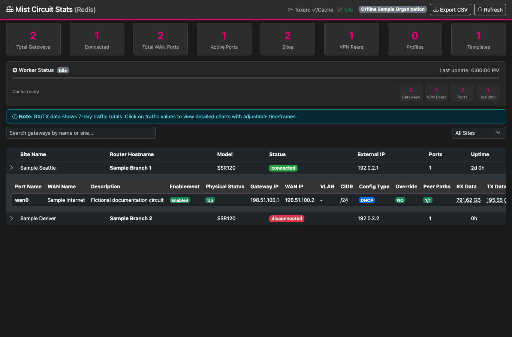
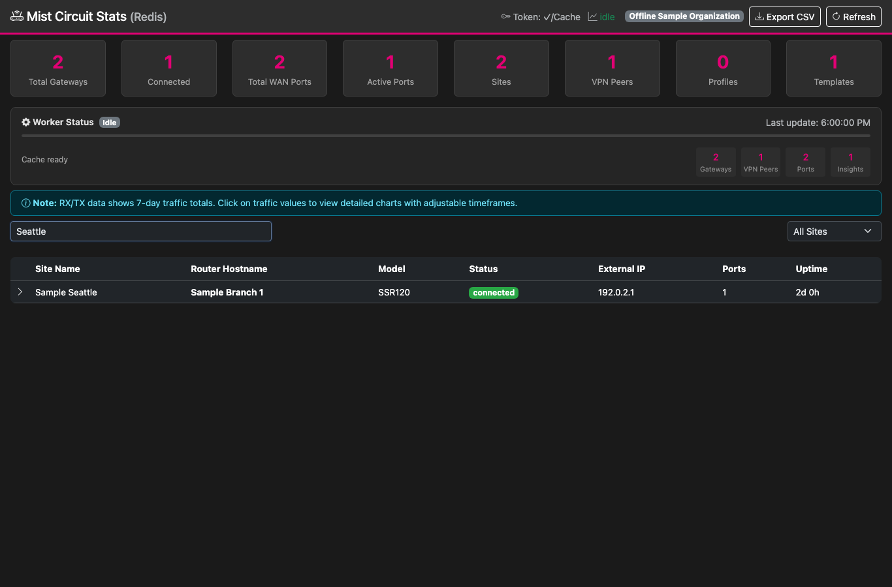
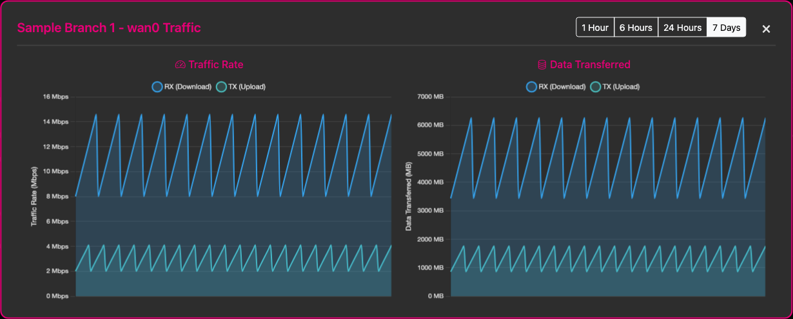
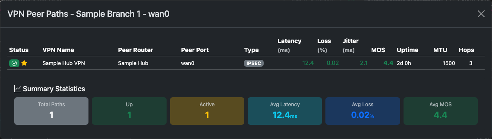

# MistCircuitStats-Redis

## What

A Redis-backed dashboard for Juniper Mist Gateway WAN port statistics, VPN
peer paths, and traffic charts. These are genuine captures of the application
running locally with **fictional offline sample data**, not production telemetry.

## How

Clone this repository, copy `.env.example` to `.env`, configure your Mist API
tokens, then run `docker compose up -d`. Open <http://localhost:5000>.
Only the background worker calls Mist; the web application reads Redis.

See the [operations and development guide](docs/guide.md) for prerequisites,
configuration, architecture, API endpoints, and troubleshooting context.
See [offline screenshots](docs/screenshots.md) to reproduce the UI captures
without Mist credentials or a Redis server.

## Where

Source and releases: [jmorrison-juniper/MistCircuitStats-Redis](https://github.com/jmorrison-juniper/MistCircuitStats-Redis).
Run locally or on a Docker host with access to your Mist cloud and Redis.
Detailed documentation lives in [docs/](docs/guide.md).

## When

Use it to inspect cached circuit health and traffic across multiple sites.
The worker refreshes every 300 seconds by default; cache TTL is three times
the configured worker interval. A fresh deployment needs its first worker
fetch before real data appears.

## Why

Separate collection from browsing so concurrent users share cached results
instead of consuming additional Mist API tokens. Redis AOF persistence keeps
cached data across container restarts, subject to its TTL.

## Who

For network operators managing Juniper Mist Gateways. Maintained in the
[jmorrison-juniper repository](https://github.com/jmorrison-juniper/MistCircuitStats-Redis);
report problems in [GitHub issues](https://github.com/jmorrison-juniper/MistCircuitStats-Redis/issues).
Licensed under [CC BY-NC-SA 4.0](LICENSE).
